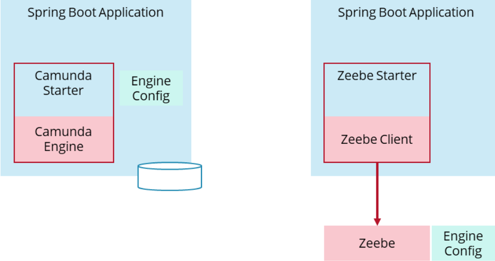
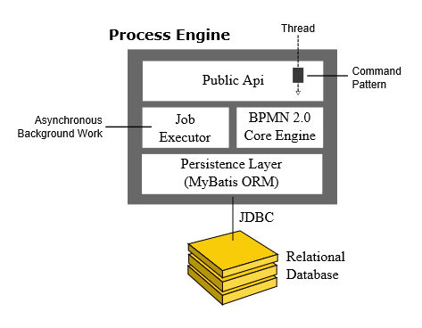

# About Camunda

## 0 Evolution …


### [Process solutions C7 VS C8](https://docs.camunda.io/docs/guides/migrating-from-camunda-platform-7/#process-solutions-using-spring-boot) 



> https://docs.camunda.io/assets/images/architecture-spring-boot-bf6dd222a3c1faed75636d5375650b15.png

### The current recommendation


## [1 Architecture](https://docs.camunda.org/manual/latest/introduction/architecture/)

### Process Engine Architecture



### Camunda Platform Architecture

#### Embedded Process Engine


| Spring Boot Starter version | Camunda Platform version | Spring Boot version |
| :-------------------------- | :----------------------- | :------------------ |
| 7.18.x                      | 7.18.x                   | 2.7.x               |

| Camunda Platform version | Quarkus version |
| :----------------------- | :-------------- |
| 7.19.x                   | 2.16.x.Final    |


```xml
<!-- Spring Boot -->
<dependency>
  <groupId>org.camunda.bpm.springboot</groupId>
  <artifactId>camunda-bpm-spring-boot-starter</artifactId>
  <version>7.18.0</version>
</dependency>

<!-- Quarkus -->
<dependency>
  <groupId>org.camunda.bpm.quarkus</groupId>
  <artifactId>camunda-bpm-quarkus-engine</artifactId>
  <version>7.18.0</version>
</dependency>

<!-- JUnit 5 -->
<dependency>
  <groupId>org.camunda.bpm</groupId>
  <artifactId>camunda-bpm-junit5</artifactId>
  <version>7.18.0</version>
  <scope>test</scope>
</dependency>
```

>  - <https://docs.camunda.org/manual/latest/user-guide/spring-boot-integration/>
>  - <https://docs.camunda.org/manual/latest/user-guide/quarkus-integration/>
>  - <https://docs.camunda.org/manual/latest/user-guide/testing/>

#### Remote Process Engine Cluster


Container-Managed Process Engine and Camunda Cockpit, Tasklist, Admin

- Apache Tomcat
- Wildfly Application Server
- …

## 2 Modeler

### Modeling Standards

1. Business Process Model and Notation (BPMN) is a standard for Workflow and Process Automation. 
   - [BPMN 2.0](https://docs.camunda.org/manual/latest/reference/bpmn20/)
   - [BPMN Model API](https://docs.camunda.org/manual/latest/user-guide/model-api/bpmn-model-api/)
2. Case Management Model and Notation (CMMN) is a standard for Case Management. 
   - [CMMN 1.1](https://docs.camunda.org/manual/latest/reference/cmmn11/)
   - [CMMN Model API](https://docs.camunda.org/manual/latest/user-guide/model-api/cmmn-model-api/)
3. Decision Model and Notation (DMN) is a standard for Business Decision Management. 
   - [DMN 1.3](https://docs.camunda.org/manual/latest/reference/dmn/)
   - [DMN Model API](https://docs.camunda.org/manual/latest/user-guide/model-api/dmn-model-api/)


### Modeling Tools

1. [bpmn.io](https://github.com/bpmn-io): Rendering toolkits and editors for BPMN 2.0, DMN, and forms.

2. [Desktop Modeler](https://github.com/camunda/camunda-modeler): An integrated modeling solution for BPMN, DMN, and Forms based on bpmn.io.

   DOWNLOAD：<https://github.com/camunda/camunda-modeler/releases>

## 3 Camunda Platform Run

https://downloads.camunda.cloud/release/

https://downloads.camunda.cloud/release/camunda-bpm/run/7.18/

```sh
# https://docs.camunda.org/manual/7.18/user-guide/camunda-bpm-run/
$ cd camunda-bpm-run-7.18.0 
$ sh start.sh 
...
  Spring-Boot:  (v2.7.3)
  Camunda Platform: (v7.18.0)
```

http://localhost:8080/camunda
demo/demo

## 4 External Task Client


https://github.com/camunda-community-hub/awesome-camunda-7-external-clients


## 5 Spin(C8 doesn’t support)

Camunda Spin is a library for simple XML and JSON processing on the JVM (Java Virtual Machine), targeting Java and JVM-based scripting languages such as Groovy, JRuby, Jython, JavaScript and Java Expression Language. It provides a comprehensible fluent API for working with different data formats through lightweight wrapper objects.

## 6 Telemetry

### Collect

[General data](https://docs.camunda.org/manual/latest/introduction/telemetry/#general-data)

[Meta and environment data](https://docs.camunda.org/manual/latest/introduction/telemetry/#meta-and-environment-data)

[Usage data](https://docs.camunda.org/manual/latest/introduction/telemetry/#usage-data)

[Logger](https://docs.camunda.org/manual/latest/introduction/telemetry/#usage-data)

### Access

#### Java API

```java
ProcessEngine processEngine = ...;
ManagementService managementService = processEngine.getManagementService();

TelemetryData telemetryData = managementService.getTelemetryData();
Internals productInternals = telemetryData.getProduct().getInternals();

String jdkVendor = productInternals.getJdk().getVendor();
String jdkVersion = productInternals.getJdk().getVersion();
```

#### REST API

[Get Telemetry Data](https://docs.camunda.org/manual/latest/reference/rest/specification/#tag/Telemetry/operation/getTelemetryData)

## Reference

### DOC

- C8 <https://docs.camunda.io>
- C7 <https://docs.camunda.org>

### FORUM

- <https://forum.camunda.io>

### TUTORIAL

[Camunda Platform 7 Tutorial](https://www.youtube.com/watch?v=sgcSm7YneTs&list=PLJG25HlmvsOVssaiPmavxv3htN_dXS3BW)

source code: https://github.com/camunda-community-hub/Camunda-7-Spring-Boot-Tutorial-Lafayette

