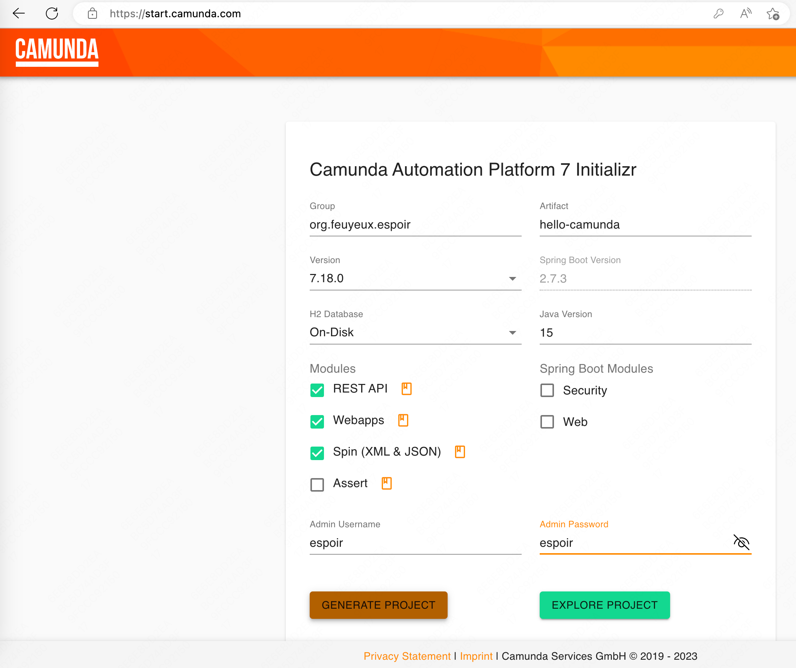

# hello-camunda

## 1 Embedded

### Camunda Automation Platform 7 Initializr 
https://start.camunda.com/

### Spring-boot Integration

<https://docs.camunda.org/manual/latest/user-guide/spring-boot-integration>

### Service Task

#### Calling Java Code

There are four ways of declaring how to invoke Java logic:

- Specifying a class that implements a [JavaDelegate]([Delegation Code | docs.camunda.org](https://docs.camunda.org/manual/latest/user-guide/process-engine/delegation-code/#java-delegate)) or [ActivityBehavior]([Delegation Code | docs.camunda.org](https://docs.camunda.org/manual/latest/user-guide/process-engine/delegation-code/#activity-behavior))
- Evaluating an expression that resolves to a delegation object
- Invoking a method expression
- Evaluating a value expression

Camunda Platform 7 uses [JUEL (Java Unified Expression Language)](https://docs.camunda.org/manual/latest/user-guide/process-engine/expression-language/) as the expression language. In the embedded engine scenario, expressions can even read into beans (Java object instances) in the application.

Camunda Platform 8 uses [FEEL (Friendly-Enough Expression Language](https://docs.camunda.io/docs/components/modeler/feel/what-is-feel/) and expressions can only access the process instance data and variables.

## 2 External tasks

